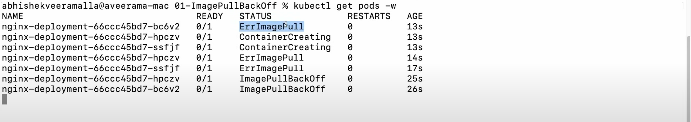

# ImagePullBackoff

When a kubelet starts creating containers for a Pod using a container runtime, it might be possible the container is in Waiting state because of ImagePullBackOff.

The status ImagePullBackOff means that a container could not start because Kubernetes could not pull a container image for reasons such as 

- Invalid image name or 
- Pulling from a private registry without imagePullSecret. 

The BackOff part indicates that Kubernetes will keep trying to pull the image, with an increasing back-off delay.

Kubernetes raises the delay between each attempt until it reaches a compiled-in limit, which is 300 seconds (5 minutes).

ImagePullBackoff
------------------
## Troubleshooting 
kubectl cheatsheet [kubectl cheatsheet ref](https://kubernetes.io/docs/reference/kubectl/quick-reference/)
```sh
kubectl describe pod <pod-name>
```
## ErrorImagePull
* ErrorImagePull is ultimately converted into ImagePullBackoff
* Error image pull means waits for the image to be pulled 
    * First three attempts it consider that image is not pulled because of the network issues 
    * After first 3 attempts it consider that the it is not Network Issue and it converted into ImagePullBackoff
    
    
